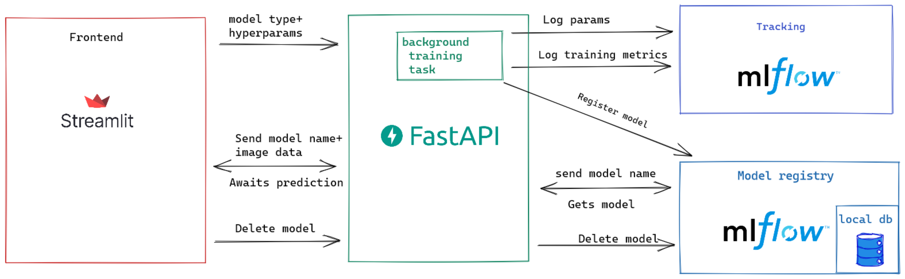

# fastapi + MLflow + streamlit + AWS

<p style="text-align:center">
 


</p>
<br> 
</br>

This is a modified version of [mnist mlops learning](https://github.com/zademn/mnist-mlops-learning) project. Kudos to [zademn](https://github.com/zademn/mnist-mlops-learning)! <br>
<br>
> Due to the monthly cost I shutted down the app. [Screenshots](https://github.com/silverstone1903/hr-attrition-mlops#screenshots) 👇🏻
>  
Streamlit URL: ~~[streamlit.gumustas.tech](http://streamlit.gumustas.tech/)~~ <br>
MLFlow URL: ~~[mlflow.gumustas.tech](http://mlflow.gumustas.tech)~~ <br>

Blog post (in Turkish): [fastapi + MLflow + streamlit + AWS = MLOps](https://silverstone1903.github.io/posts/2021/10/fastapi-mlflow-streamlit-aws/)

---

Setup env.
```bash
pip install -r requirements.txt
```
# Start app
Go in the root dir and run these;

Streamlit
```bash
streamlit run frontend/streamlit_main.py
```

FastAPI 
```
uvicorn backend.main:app
```

MLflow UI
```bash
mlflow ui --backend-store-uri sqlite:///db/backend.db
```

## Docker
- Mlflow: http://localhost:5000
- FastApi: http://localhost:8000/docs
- Streamlit: http://localhost:8501/

```bash
docker-compose build
docker-compose up
```

# Architecture


# Screenshots

Due to the monthly cost I shutted down the app. Here are the screenshots: 


